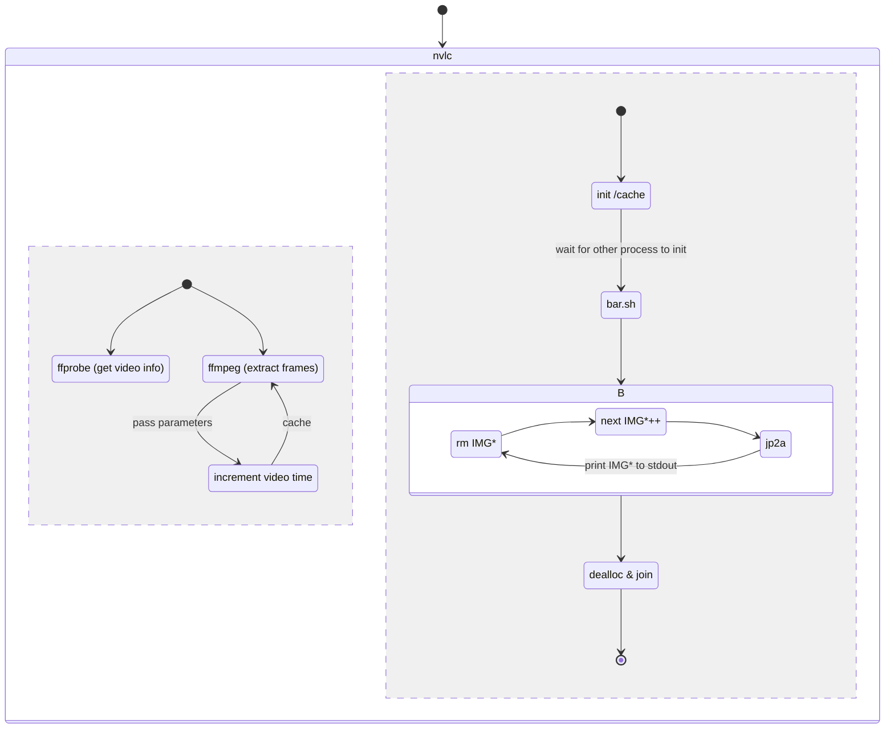

# mappsite

mappsite has the target to provide the hierarchical structure of a given website. It works bruteforcing all possible paths and testing its relative requests. 

# Development 
Run mappsite package from / : `python -m mappsite`
Test & Debug : `nosetests tests`

- [ ] connect function checking whether the resources exist
- [ ] get std input form command line
- [ ] update tree data structure when new valid link is found
- [ ] store result in file (after ^C)
- [ ] how to write documentation in `/docs` 

flow control

## Images
[comment]: <> (hahaha)

