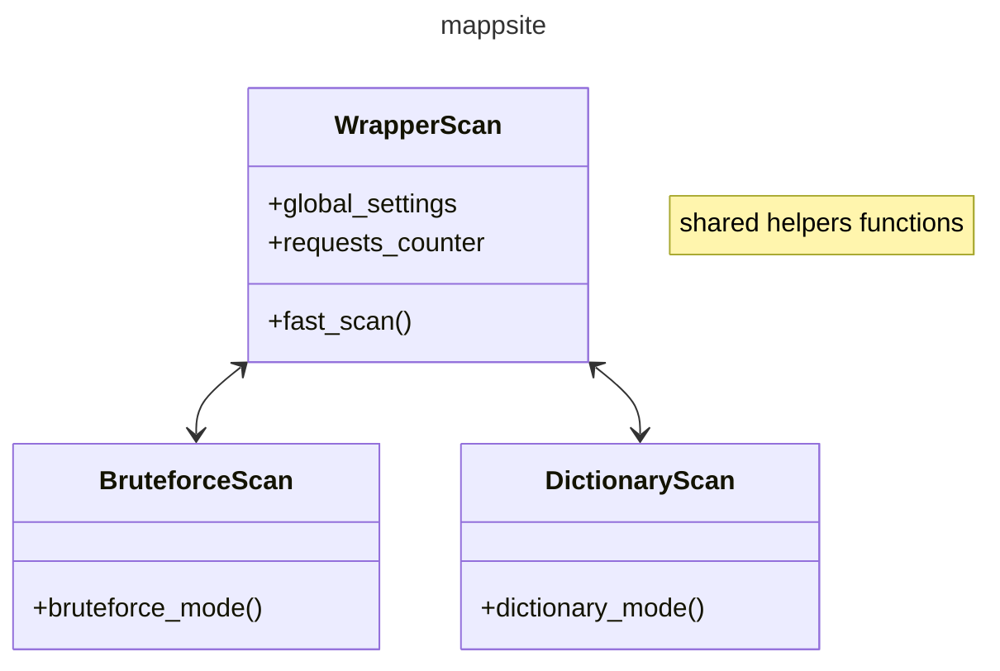
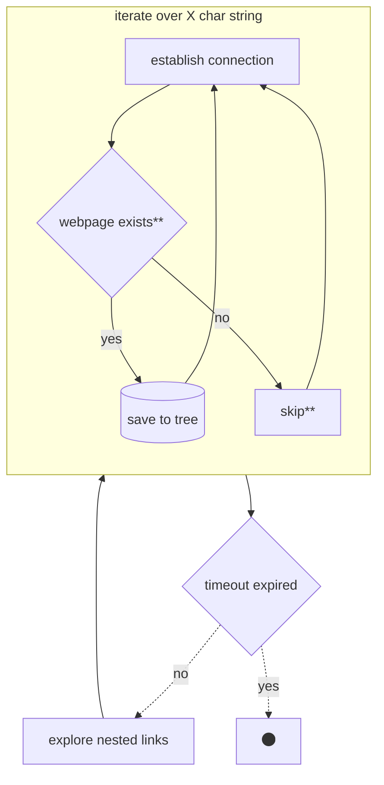

# mappsite
mappsite has the target to provide the hierarchical structure of a given website. It works bruteforcing all possible paths and testing its relative requests. 

# Development 
Run mappsite package from / : `python -m mappsite`
Test & Debug : `nosetests tests`

##### How to contribute
Do whatever you want but always test your functions when commiting. :-)

##### UI:
* https://towardsdatascience.com/rich-generate-rich-and-beautiful-text-in-the-terminal-with-python-541f39abf32e
* https://opensource.com/article/17/5/4-practical-python-libraries
* https://betterprogramming.pub/designing-beautiful-command-line-applications-with-python-72bd2f972ea
* https://www.freecodecamp.org/news/use-the-rich-library-in-python/
* https://python-prompt-toolkit.readthedocs.io/en/stable/pages/tutorials/repl.html
* https://towardsdatascience.com/a-simple-guide-to-command-line-arguments-with-argparse-6824c30ab1c3

##### Fast scan:
* https://morioh.com/p/f346243ef56e

##### On using corutines:
* https://stackoverflow.com/questions/19302530/what-is-the-purpose-of-the-send-function-on-python-generators
* http://www.dabeaz.com/coroutines/
* https://realpython.com/introduction-to-python-generators/
* https://www.programiz.com/python-programming/iterator

##### Choosing the `test_connection` library:
* https://stackoverflow.com/questions/27435284/multiprocessing-vs-multithreading-vs-asyncio
* https://stackoverflow.com/questions/22190403/how-could-i-use-requests-in-asyncio
* https://stackoverflow.com/questions/16778435/python-check-if-website-exists
* https://treelib.readthedocs.io/en/latest/treelib.html

##### OOP structure:
* https://realpython.com/python3-object-oriented-programming/

##### Dictionary Mode:

##### Bruteforce Mode:

##### Tests:
* https://www.youtube.com/watch?v=6tNS--WetLI

##### TO-ADD features:
- [x] connect function checking whether the resources exist
- [ ] get std input form command line see
- [x] update tree data structure when new valid link is found
- [ ] store result in file (after ^C)
- [ ] how to write documentation in `/docs`
- [ ] write `handle_input` function with UI
- [x] dictionary mode
- [ ] multiple file reload in dictionary mode
- [ ] fast mode with BeautifulSoup
- [ ] bruteforce mode
- [ ] write performance test
- [ ] check timeout website IP block
- [ ] automatically update dictionary using github, putting on the top of the file the most common links
- [ ] create python package with github actions

## Images
[comment]: <> (hahaha)

