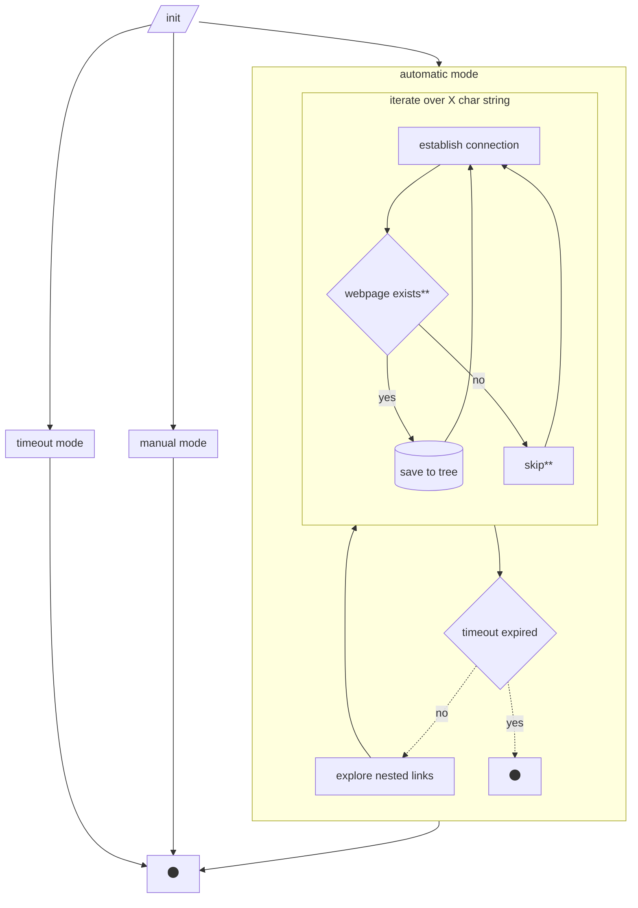

# mappsite

mappsite has the target to provide the hierarchical structure of a given website. It works bruteforcing all possible paths and testing its relative requests. 

# Development 
Run mappsite package from / : `python -m mappsite`
Test & Debug : `nosetests tests`

- [ ] connect function checking whether the resources exist
- [ ] get std input form command line see
- [ ] update tree data structure when new valid link is found
- [ ] store result in file (after ^C)
- [ ] how to write documentation in `/docs` 
- [ ] automatic, timeout and manual mode

Useful links
https://stackoverflow.com/questions/16778435/python-check-if-website-exists
https://towardsdatascience.com/a-simple-guide-to-command-line-arguments-with-argparse-6824c30ab1c3
https://www.programiz.com/python-programming/iterator
https://treelib.readthedocs.io/en/latest/treelib.html
https://www.geeksforgeeks.org/multithreading-python-set-1/
https://www.digitalocean.com/community/tutorials/python-multiprocessing-example
https://realpython.com/python3-object-oriented-programming/

flow control

## Images
[comment]: <> (hahaha)

