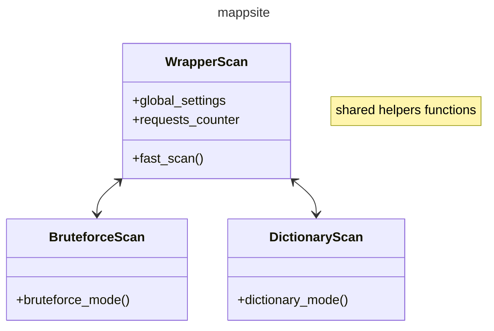
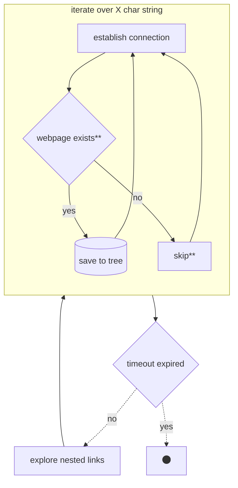

# Development 
Run mappsite package from / : `python -m mappsite`
Test & Debug : `python -m unittest` from the project root folder (`path/to/mappsite`)
for tests see: https://www.youtube.com/watch?v=6tNS--WetLI

##### How to contribute
Do whatever you want but always test your functions when commiting. :-)

##### TO-ADD features (in order of priority):
- [ ] better comments
- [ ] how to write documentation in `/docs`
- [ ] `handle_user_input` simple terminal UI interface
- [ ] `dictionary_mode` write match actions from `dictionary_mode`
- [ ] set logging rules and conformity
- [ ] `BruteforceScan` complete refactor to use `handle_user_input`
- [ ] fast mode with BeautifulSoup && (partial) standalone BeautifulSoup website crawler [implementation example](https://morioh.com/p/f346243ef56e)
- [ ] store result in file (after ^C)
- [ ] command line options with [argparse](https://realpython.com/command-line-interfaces-python-argparse/) [link2](https://towardsdatascience.com/a-simple-guide-to-command-line-arguments-with-argparse-6824c30ab1c3)
- [ ] simple UI with [prompt_toolkit](https://python-prompt-toolkit.readthedocs.io/en/stable/pages/asking_for_input.html) & [link2](https://github.com/pavdmyt/yaspin?tab=readme-ov-file)
- [ ] working progress bar with `prompt_toolkit` (ask on stackoverflow?)
- [ ] advanced UI [link](https://opensource.com/article/17/5/4-practical-python-libraries) with [autosuggetions](https://python-prompt-toolkit.readthedocs.io/en/stable/pages/tutorials/repl.html)
- [ ] multiple file reload in dictionary mode
- [ ] write performance test
- [ ] check timeout website IP block
- [ ] automatically update dictionary using github, putting on the top of the file the most common links
- [ ] create python package with github actions
- [x] connect function checking whether the resources exist
- [x] update tree data structure when new valid link is found
- [x] dictionary mode

#### Python useful features
##### On using corutines:
* https://stackoverflow.com/questions/19302530/what-is-the-purpose-of-the-send-function-on-python-generators
* http://www.dabeaz.com/coroutines/
* https://realpython.com/introduction-to-python-generators/
* https://www.programiz.com/python-programming/iterator

##### Choosing the `test_connection` library:
* https://stackoverflow.com/questions/27435284/multiprocessing-vs-multithreading-vs-asyncio
* https://stackoverflow.com/questions/22190403/how-could-i-use-requests-in-asyncio
* https://stackoverflow.com/questions/16778435/python-check-if-website-exists
* https://treelib.readthedocs.io/en/latest/treelib.html

##### OOP structure:
* https://realpython.com/python3-object-oriented-programming/

##### Dictionary Mode:

##### Bruteforce Mode:

